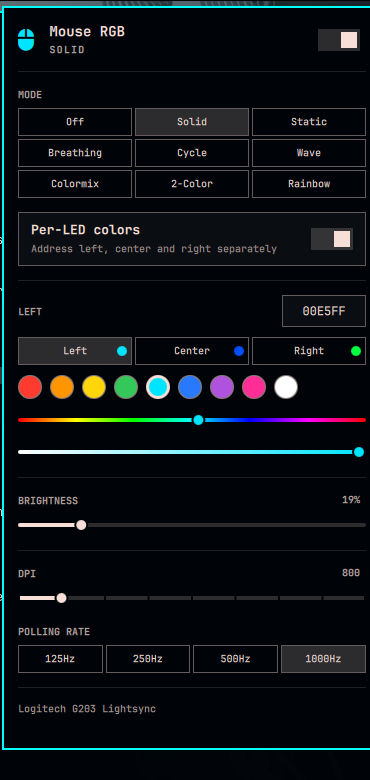

# omarchy-mouse-rgb

Full RGB, DPI, and polling-rate control for a **Logitech G203/G102
Lightsync**, as a native [Omarchy](https://omarchy.org/) (Hyprland) bar
widget — built because `openrgb`'s CLI is unusable for this device and its
GUI doesn't belong in a tiling-WM bar.




## Why this exists

`openrgb`'s command-line interface has three real bugs against this specific
device, found by reading its actual driver source
([`LogitechG203LController.cpp`](https://gitlab.com/CalcProgrammer1/OpenRGB)):

- **Speed does nothing.** The CLI computes `speed_max - speed_min` into an
  `unsigned int`. This device reports an *inverted* scale (`min=20000,
  max=1000`), so the subtraction underflows to ~4.3 billion and every
  `--speed` value except `0` sends garbage bytes.
- **Colormix looks dead.** It's a speed-only effect, so the bug above freezes
  it too.
- **No color in any effect mode.** The driver allocates a color slot but
  never sets `colors_min`/`colors_max`, so both read `0`. The CLI validates
  `count >= min && count <= max` and rejects every color for Static and
  Breathing — even though the slot itself is real and writable.

Switching to OpenRGB's **SDK protocol** (`openrgb-python`) instead of the CLI
sidesteps all three — verified against the real device, not just the source.

On top of that, three more issues turned up that a naive polling daemon
wouldn't have caught:

- **Solid color reverts to the mouse's factory pattern after a few
  seconds.** "Solid" is OpenRGB's Direct mode — a live stream, not a stored
  setting. The firmware watchdogs for frames and falls back to its built-in
  default if the host goes quiet. Fixed with a 2-second heartbeat resend.
- **RGB and DPI can't be touched at the same time.** Both travel over the
  same HID++ channel. Animating in Direct mode while `ratbagd` tries to set
  DPI starves it into `USB error: Connection timed out (110)`. Fixed by
  making the daemon the single serialization point for all device I/O.
- **Suspend silently wipes the LEDs.** Every suspend/resume issues a USB
  *reset* on this device (confirmed via `journalctl` and reproduced directly
  with the `USBDEVFS_RESET` ioctl) — same hidraw node, no new device, so no
  `udev add` event fires to trigger recovery. A `systemd-sleep` hook nudges
  the daemon to resend on wake.

## What's here

This repo *is* the Omarchy plugin — `manifest.json` is at the root, so it
installs directly with `omarchy plugin add`. `backend/` holds the daemon it
talks to, which isn't part of the plugin bundle itself.

| Path | What it is |
|---|---|
| `manifest.json`, `Panel.qml`, `Model.js` | The bar widget itself. |
| `backend/mouse_rgb.py` | The daemon. Owns the OpenRGB SDK connection, serializes RGB + DPI/rate access, runs the Direct-mode heartbeat, animates the two software-only effects. |
| `backend/systemd/openrgb-server.service` | Runs `openrgb --server` (the SDK server). |
| `backend/systemd/mouse-rgb-effect.service` | Runs the daemon. |
| `backend/systemd/51-mouse-rgb-resume` | Resume-from-sleep hook — **must** live in `/usr/lib/systemd/system-sleep/`, not `/etc` (see note below). |
| `backend/udev/99-mouse-rgb-recover.rules` + `backend/bin/mouse-rgb-recover` | Restarts the RGB stack if the mouse actually re-enumerates (unplug/replug), which changes its hidraw node. |

## Modes

**Hardware** (native effects, run entirely on the mouse's controller):
Off · Solid · Static · Breathing · Cycle · Wave · Colormix

**Software** (animated by the daemon in Direct mode, because the hardware
can't do them): **2-Color** breathing between two colors you pick · **Rainbow**

Per-mode reality, not aspiration — some things genuinely aren't controllable
on this device/OpenRGB-version combination:

| Mode | Color | Speed | Brightness |
|---|:---:|:---:|:---:|
| Solid | ✅ (emulated via HSV value, since Direct has no native brightness) | – | ✅ |
| Breathing | ❌ (CLI/driver bug, uses last hardware color) | ✅ | ✅ |
| Cycle / Wave / Colormix | – | ✅ | ✅ |
| 2-Color / Rainbow | ✅ | ✅ | ✅ |

Wave also has a real Left/Right direction byte in the firmware, exposed here
even though no OpenRGB CLI flag for it ever existed.

## Install

The backend (daemon, systemd units, udev rule) has to be set up by hand
first — paths and the `arrow` username in there are specific to my machine,
adjust for yours:

```bash
python3 -m venv ~/.local/share/mouse-rgb/venv
~/.local/share/mouse-rgb/venv/bin/pip install -r backend/requirements.txt
cp backend/mouse_rgb.py ~/.local/share/mouse-rgb/

cp backend/systemd/openrgb-server.service backend/systemd/mouse-rgb-effect.service ~/.config/systemd/user/
systemctl --user enable --now openrgb-server.service mouse-rgb-effect.service

sudo cp backend/systemd/51-mouse-rgb-resume /usr/lib/systemd/system-sleep/
sudo chmod 755 /usr/lib/systemd/system-sleep/51-mouse-rgb-resume

sudo cp backend/bin/mouse-rgb-recover /usr/local/bin/
sudo chmod 755 /usr/local/bin/mouse-rgb-recover
sudo cp backend/udev/99-mouse-rgb-recover.rules /etc/udev/rules.d/
sudo udevadm control --reload-rules
```

Also needs [`libratbag`](https://github.com/libratbag/libratbag) (`ratbagd`
+ `ratbagctl`) for the DPI/polling-rate section — D-Bus activated, no manual
start needed.

Then the plugin itself installs the normal Omarchy way:

```bash
omarchy plugin add https://github.com/Hi-im-Connect/omarchy-mouse-rgb.git --enable
omarchy bar put arrow.mouse-rgb --after omarchy.tray
```

If `Model.js`'s `HELPER_PYTHON`/`HELPER_SCRIPT` paths at the top don't match
where you put the venv and `mouse_rgb.py` above, edit those two lines after
installing.

### The `/etc` vs `/usr/lib` trap

`man systemd-suspend.service` on this system documents only
`/usr/lib/systemd/system-sleep/` as the sleep-hook directory — never `/etc`.
A hook placed in `/etc/systemd/system-sleep/` will run perfectly when
invoked by hand and will **never** run automatically, with no error either
way. Costed a full debugging round to catch; not repeating it here.

## Hardware

Logitech G203/G102 Lightsync — `046d:c092` — 3 independently-addressable
LEDs (left / center / right), tested on Omarchy (Hyprland, Quickshell shell)
with `openrgb 1.0rc3` and `libratbag 0.18`.
